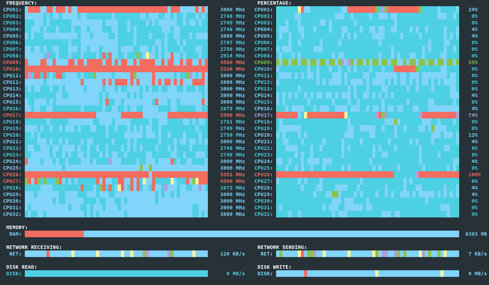

# cpu_freqs
Python script for CPU frequencies monitoring.

This script is graphical (NCurses) lighweight CPU %/frequency, RAM, network and disk usage monitor. Works in a terminal (graphical/tty).

Requirments:
- Python 3 (tested on 3.10 and 3.11),
- psutil package
- curses package (should be in the standard library for Linux, see windows-curses for Windows)

Command line arguments:
- -v, --vertical    puts 'PERCENTAGE' graph under 'FREQUENCY' graph (by default, it goes right);
- -s, --single      uses single pallete for all graphs, useful when terminal doesn't let the script register enough colors (tty);
- -d, --default     forces the script to use default terminal colors (tty/Emacs vterm);
- -b, --black       basically, light themed --default [If, for some reason, black and white colors are swapped, this option may serve as a substitute for --default].

# Examples
cpu_freqs running in Emacs vterm terminal emulator

